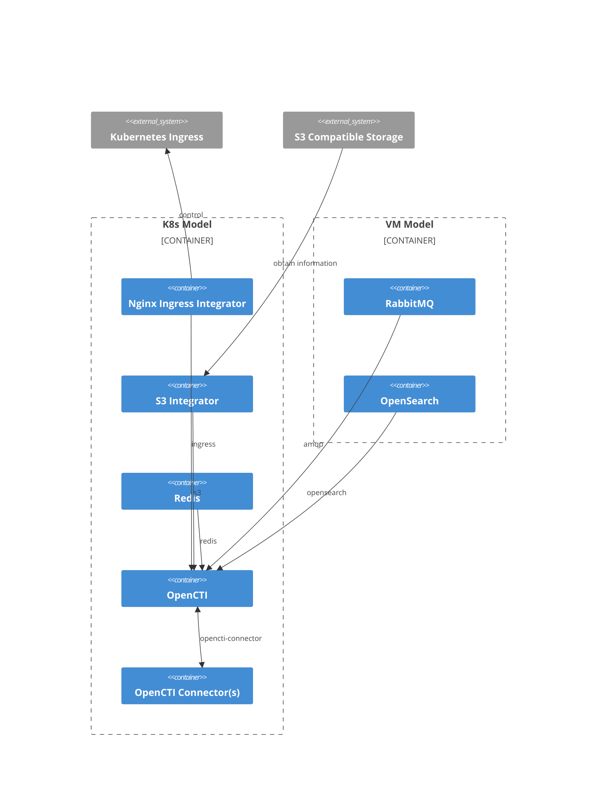
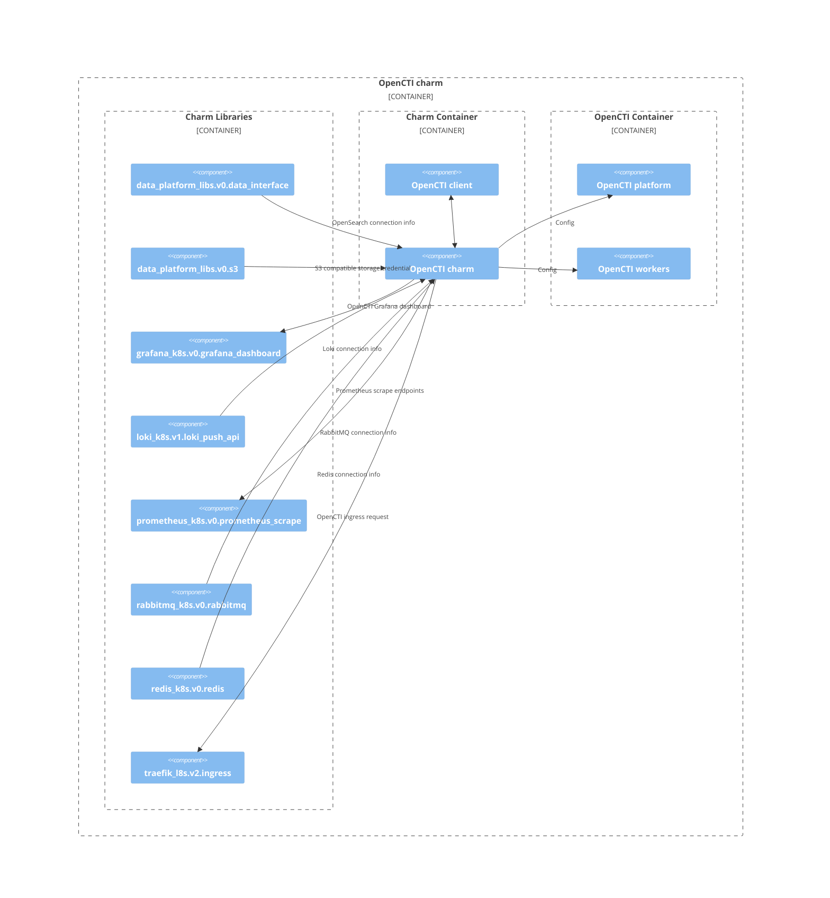

# Charm architecture

[OpenCTI](https://filigran.io/solutions/open-cti/) is a 
[NodeJS](https://nodejs.org/en) application that integrates with 
[OpenSearch](https://opensearch.org/), [Redis](https://redis.io/), and 
[RabbitMQ](https://www.rabbitmq.com/).

The charm design leverages the [sidecar](https://kubernetes.io/blog/2015/06/the-distributed-system-toolkit-patterns/#example-1-sidecar-containers)
pattern to allow multiple containers in each pod with 
[Pebble](https://juju.is/docs/sdk/pebble) running as the workload container’s 
entrypoint.

Pebble is a lightweight, API-driven process supervisor that is responsible for
configuring processes to run in a container and controlling those
processes throughout the workload lifecycle.

Pebble `services` are configured through [layers](https://github.com/canonical/pebble#layer-specification), 
and the following containers represent each one a layer forming the effective 
Pebble configuration, or `plan`:

1. A `charm` container, which contains the charm code that interact with the Juju system.
2. The [`opencti`](https://filigran.io/solutions/open-cti/) container itself, which runs the OpenCTI platform and OpenCTI workers.

As a result, if you run a `kubectl get pods` on a namespace named for the Juju 
model you've deployed the OpenCTI charm into, you'll see something like the 
following:

```bash
NAME                                   READY   STATUS    RESTARTS   AGE
opencti-0                              2/2     Running   4 (11m ago)   3h20m
```

And if you run `kubectl describe pod opencti-0`, all the containers will have 
as Command ```/charm/bin/pebble```. That's because Pebble is responsible for
the processes startup as explained above.

## High-level overview of an OpenCTI deployment

Below is a diagram of a basic OpenCTI deployment. It consists of two Juju models:
one VM model for deploying OpenSearch and RabbitMQ, and a K8s model for 
deploying OpenCTI along with the rest of its dependencies. With the base OpenCTI
charm deployed, users can choose from several OpenCTI connector charms to 
integrate with the OpenCTI charm.



## Charm architecture diagram

The OpenCTI charm utilizes many charm libraries provided by the charm community
to handle Juju integrations with all the dependencies of OpenCTI. It uses the 
Pebble API and an OpenCTI GraphQL client to set up and configure the OpenCTI 
platform and workers inside the OpenCTI container.



## OCI images

We use [Rockcraft](https://canonical-rockcraft.readthedocs-hosted.com/en/latest/) to build OCI Images for the OpenCTI charm. 
The images are defined in the [opencti rock](https://github.com/canonical/opencti-operator/blob/main/opencti_rock/rockcraft.yaml).
They are published to [Charmhub](https://charmhub.io/), the official repository of charms.

> See more: [How to publish your charm on Charmhub](https://juju.is/docs/sdk/publishing)

## Containers

Configuration files for the containers can be found in the respective directories that define the rocks.

### `opencti` container

The `opencti` container runs the OpenCTI platform and OpenCTI workers.
In every container, one instance of OpenCTI platform and three instances of 
OpenCTI workers are running. The ratio is recommended by the [OpenCTI deployment guide](https://docs.opencti.io/latest/deployment/clustering/).

The workload that this container is running is defined in the [opencti rock](https://github.com/canonical/opencti-operator/blob/main/opencti_rock/rockcraft.yaml).

## Metrics

### OpenCTI metrics

OpenCTI platform in the OpenCTI charm is [configured to expose prometheus on port `14269`](https://docs.opencti.io/latest/deployment/configuration/#telemetry). 
 
## Juju events

For this charm, the following Juju events are observed:

1. [`config-changed`](https://canonical-juju.readthedocs-hosted.com/en/latest/user/reference/hook/#config-changed)
2. [`upgrade-charm`](https://canonical-juju.readthedocs-hosted.com/en/latest/user/reference/hook/#upgrade-charm)
3. [`update-status`](https://canonical-juju.readthedocs-hosted.com/en/latest/user/reference/hook/#update-status)
4. [`secret-changed`](https://canonical-juju.readthedocs-hosted.com/en/latest/user/reference/hook/#secret-changed)
5. [`opencti-pebble-ready`](https://canonical-juju.readthedocs-hosted.com/en/latest/user/reference/hook/#container-pebble-ready)
6. [`opencti-peer-relation-created`](https://canonical-juju.readthedocs-hosted.com/en/latest/user/reference/hook/#endpoint-relation-created)
7. [`opencti-peer-relation-changed`](https://canonical-juju.readthedocs-hosted.com/en/latest/user/reference/hook/#endpoint-relation-changed)
8. [`opencti-peer-relation-departed`](https://canonical-juju.readthedocs-hosted.com/en/latest/user/reference/hook/#endpoint-relation-departed)
9. [`opencti-peer-relation-broken`](https://canonical-juju.readthedocs-hosted.com/en/latest/user/reference/hook/#endpoint-relation-broken)
10. [`opencti-pebble-custom-notice`](https://canonical-juju.readthedocs-hosted.com/en/latest/user/reference/hook/#container-pebble-custom-notice)
11. [`opencti-connector-relation-joined`](https://canonical-juju.readthedocs-hosted.com/en/latest/user/reference/hook/#endpoint-relation-joined)
12. [`opencti-connector-relation-changed`](https://canonical-juju.readthedocs-hosted.com/en/latest/user/reference/hook/#endpoint-relation-changed)
13. [`stop`](https://canonical-juju.readthedocs-hosted.com/en/latest/user/reference/hook/#stop)

And many events observed by charm libraries.

> See more in the Juju docs: [Hook](https://juju.is/docs/sdk/event)

## Charm code overview

The `src/charm.py` is the default entry point for a charm and has the 
`OpenCTICharm` Python class which inherits from CharmBase. CharmBase is the 
base class from which all Charms are formed, defined by [Ops](https://juju.is/docs/sdk/ops) 
(Python framework for developing charms).

> See more in the Juju docs: [Charm](https://canonical-juju.readthedocs-hosted.com/en/latest/user/reference/charm/)

The `__init__` method guarantees that the charm observes all events relevant to its operation and handles them.

Take, for example, when a configuration is changed by using the CLI.

1. User runs the configuration command:
```bash
juju config opencti admin-user=secret:...
```
2. A `config-changed` event is emitted.
3. In the `__init__` method is defined how to handle this event like this:
```python
self.framework.observe(self.on.config_changed, self._reconcile)
```
4. The method `_reconcile`, for its turn, will take the necessary actions such as waiting for all the relations to be ready and then configuring the container.
