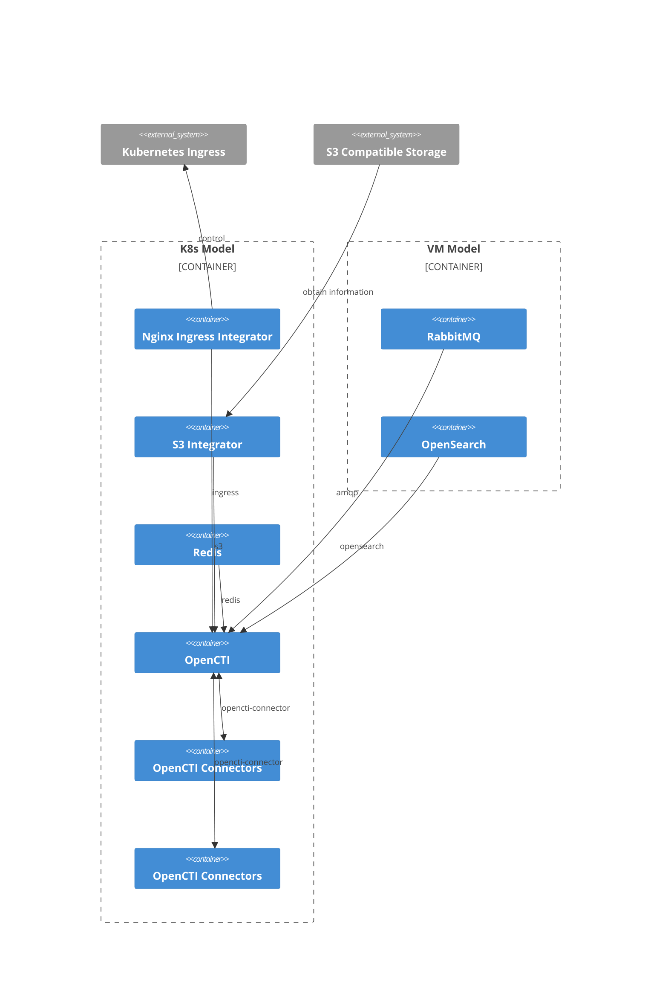

# Charm architecture

[OpenCTI](https://filigran.io/solutions/open-cti/) is a 
[NodeJS](https://nodejs.org/en) application that integrates with 
[OpenSearch](https://opensearch.org/), [Redis](https://redis.io/), and 
[RabbitMQ](https://www.rabbitmq.com/).

The charm design leverages the [sidecar](https://kubernetes.io/blog/2015/06/the-distributed-system-toolkit-patterns/#example-1-sidecar-containers)
pattern to allow multiple containers in each pod with 
[Pebble](https://juju.is/docs/sdk/pebble) running as the workload container’s 
entrypoint.

Pebble is a lightweight, API-driven process supervisor that is responsible for
configuring processes to run in a container and controlling those
processes throughout the workload lifecycle.

Pebble `services` are configured through [layers](https://github.com/canonical/pebble#layer-specification), 
and the following containers represent each one a layer forming the effective 
Pebble configuration, or `plan`:

1. A `charm` container, which contains the charm code that interact with the juju system.
2. The [`opencti`](https://filigran.io/solutions/open-cti/) container itself, which runs the OpenCTI platform and OpenCTI workers.

As a result, if you run a `kubectl get pods` on a namespace named for the Juju 
model you've deployed the OpenCTI charm into, you'll see something like the 
following:

```bash
NAME                                   READY   STATUS    RESTARTS   AGE
opencti-0                              2/2     Running   4 (11m ago)   3h20m
```

And if you run `kubectl describe pod opencti-0`, all the containers will have 
as Command ```/charm/bin/pebble```. That's because Pebble is responsible for
the processes startup as explained above.

## Charm Architecture Diagrams



## OCI images

We use [Rockcraft](https://canonical-rockcraft.readthedocs-hosted.com/en/latest/) to build OCI Images for <charm-name>. 
The images are defined in [opencti rock](https://github.com/canonical/opencti-operator/blob/main/opencti_rock/rockcraft.yaml).
They are published to [Charmhub](https://charmhub.io/), the official repository of charms.

> See more: [How to publish your charm on Charmhub](https://juju.is/docs/sdk/publishing)

## Containers

Configuration files for the containers can be found in the respective directories that define the rocks.

### `opencti` Container

The `opencti` container runs the OpenCTI platform and OpenCTI workers.
In every container, one instance of OpenCTI platform and three instances of 
OpenCTI workers are running. The ratio is recommended by the [OpenCTI deployment guide](https://docs.opencti.io/latest/deployment/clustering/).

The workload that this container is running is defined in the [opencti rock](https://github.com/canonical/opencti-operator/blob/main/opencti_rock/rockcraft.yaml).

## Metrics

### OpenCTI metrics

OpenCTI platform in the OpenCTI charm is [configured to expose prometheus on port `14269`](https://docs.opencti.io/latest/deployment/configuration/#telemetry). 
 
## Juju events

For this charm, the following Juju events are observed:

1. `config-changed`
2. `upgrade-charm`
3. `update-status`
4. `secret-changed`
5. `opencti-pebble-ready`
6. `opencti-peer-relation-created`
7. `opencti-peer-relation-changed`
8. `opencti-peer-relation-departed`
9. `opencti-peer-relation-broken`
10. `opencti-pebble-custom-notice`
11. `opencti-connector-relation-joined`
12. `opencti-connector-relation-changed`
13. `stop`

And many events observed by charm libraries.

> See more in the Juju docs: [Event](https://juju.is/docs/sdk/event)

## Charm code overview

The `src/charm.py` is the default entry point for a charm and has the 
`OpenCTICharm` Python class which inherits from CharmBase. CharmBase is the 
base class from which all Charms are formed, defined by [Ops](https://juju.is/docs/sdk/ops) 
(Python framework for developing charms).

> See more in the Juju docs: [Charm](https://juju.is/docs/sdk/constructs#heading--charm)

The `__init__` method guarantees that the charm observes all events relevant to its operation and handles them.

Take, for example, when a configuration is changed by using the CLI.

1. User runs the configuration command:
```bash
juju config opencti admin-user=secret:...
```
2. A `config-changed` event is emitted.
3. In the `__init__` method is defined how to handle this event like this:
```python
self.framework.observe(self.on.config_changed, self._reconcile)
```
4. The method `_reconcile`, for its turn, will take the necessary actions such as waiting for all the relations to be ready and then configuring the container.
